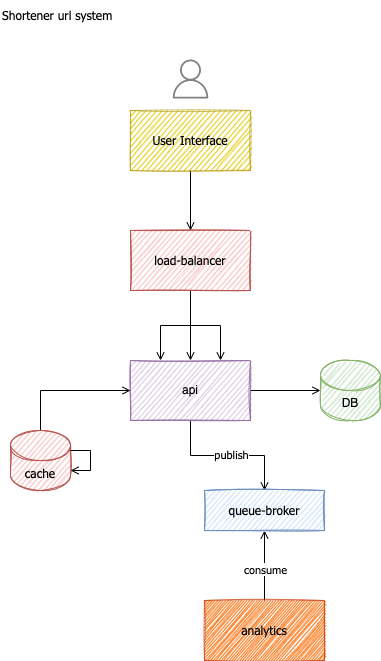
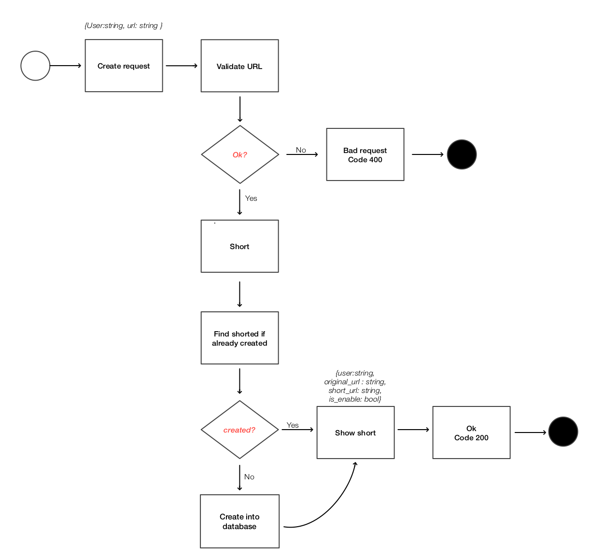
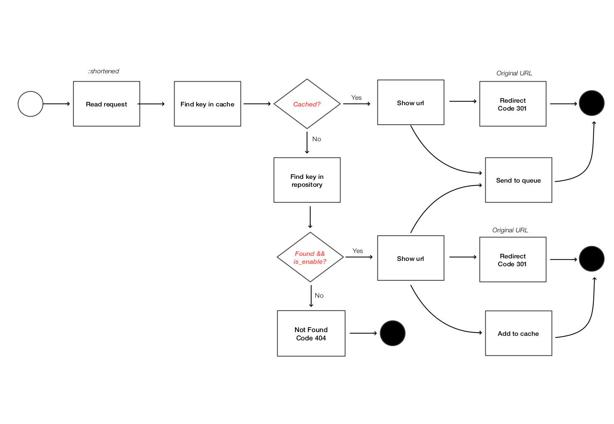
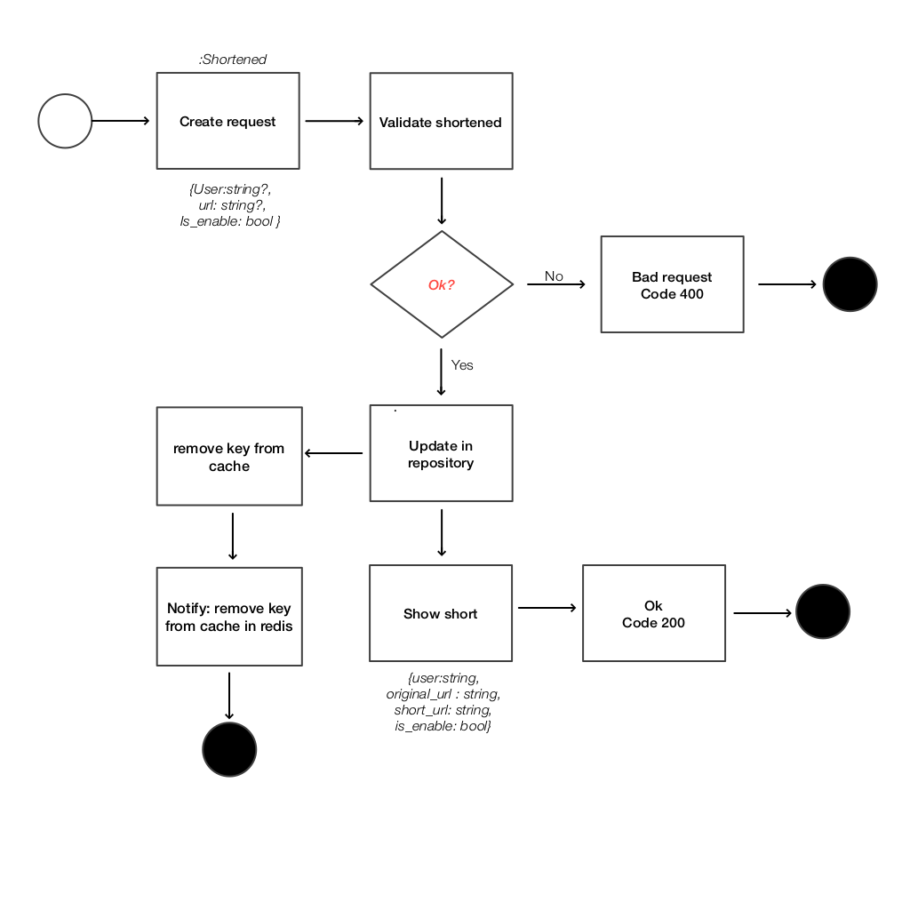

#Shortener api
By @figueyes

## Problem
A URL shortener creates an alias against an original long url. 
- Example: 
  - long: www.shortener-api.com/figueyes/this-service-is-a-demo/123456789
  - shortened: CyZ5i2D

Who will use the service?
 - registered users creates twitter marketing, and users can modify their shortened urls.
 - all people can read shortened url and redirect to original.

Assumptions
- I assume a ratio read:write = 1000:1, 1000 reads over 1 shortened-url creations.
- it is more important read quickly than write/modify. 
- shortened url should be readable to every one.
- I need 26 billions shortened urls

### Functional requirements
- remain in system, for lifetime.
- traffic/: 17rps = 1000 rpm = 1.5 Million/day = 43.2 Million/month
- manageable: enable/disable url, update original url
- analytics near real time
- size short: as small as possible, no collisions

Non functional requirements
- uptime 99,98%
- quickly + low cost
- storage for lifetime (50 years): 43.2MM requests x 12months x 250 bytes x 50 years = 6.48 TB

### Shortening Algorithm
to perform a good shortened url, I am going to build a function with the most large entropy as possible, considering:
- The input is a concatenation of url to short + user.
- Hashing the initial input. I will use SHA-256 with length of 32 bits and no-collisions found.
- Encoding the binary result to text. I will use BASE-58 encoding to reduce the output confusion (Satoshi Nakamoto, https://en.bitcoin.it/wiki/Base58Check_encoding).
- The final output will be of length 7 as default (58ˆ7 possibles ≈ 2.2 trillions). The App supports length configuration.
- Better experience to users: readable shortened url.


## Architecture
General Diagram



### Technologies
#### Database - MONGO
- I will store 26 billions shortened urls.
- the service will read database heavily and this should be fast.
- I need to scale database services easily and fast.
- The only one relation will be with user or ID url creator

#### Cache - REDIS
- I need cache to speed up reading the most clicked urls to increase performance.
  **challenges**:
- if I update a component in my url, but this url is stored in cache, What about this element?
- Redis has a pub-sub component to communicate between nodes. Then, if we modify an element in database, I can to notify to every-nodes that an element has been updated and remove it from cache.

#### Broker - KAFKA
After reading request, I need to deliver information about it to analytical component like Kibana or another api/bff with important elements like time request, url, http status (301 successfully redirected, 400 bad request, etc).
- kafka performs data in realtime.
- multiple consumers (with different id) may read messages from a specific topic.


## API

### Creation shortened URL

**POST** /shortener/

Body:
- url: string
- user: string

Response:
- status: 200 success | 400 bad request
- short_url: string




### Reading URL

**GET** /shortener/:short-url

Response:
- status: 301 success and redirect | 404 Not found
- url



### Modify component 

**PATCH** /shortener/:short-url

Body:
- url: string, optional
- user: string, optional
- is_enable: bool, optional

Response:
- status: 200
- short_url: string
  original_url: string
  is_enable: bool
  user: string



## Config
First, you need to configure an .env file with example.env variables 
### Dependencies
#### mongo
- configure a local database with localhost:[PORT] database and collection=shorts

#### redis
- configure a local database with localhost:[PORT] and db:0 
  1. cache database
  2. pub/sub to remove from cache
#### kafka
- configure kafka broker to publish message about observability
- topics:
  1. observer of data
#### zookeeper
- kafka dependence

## Running 
With Docker:
```
docker-compose up -d
```
